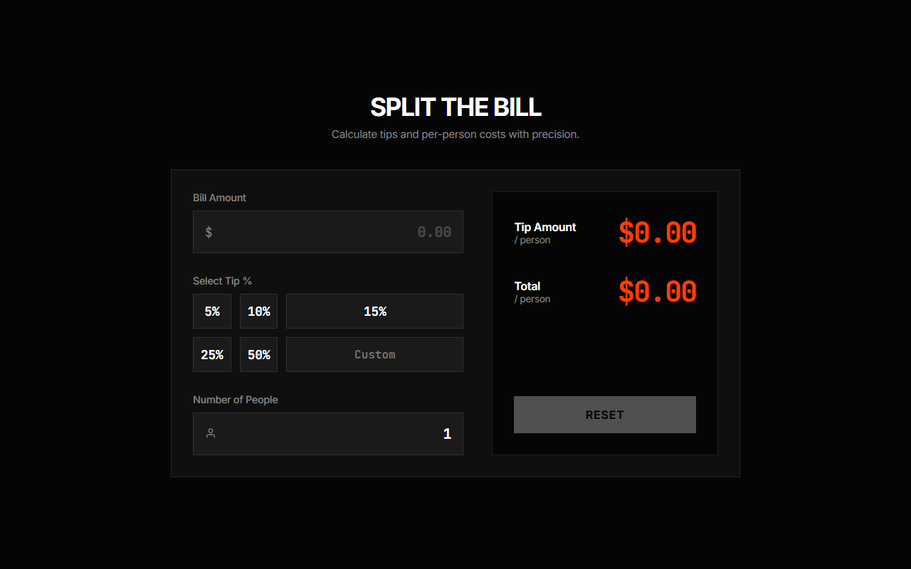

# Tip / Bill Splitter

## Description
A premium Tip Calculator and Bill Splitter with a dark Tactile Brutalism aesthetic. It allows users to input a bill amount, select a tip percentage, and divide the total cost among multiple people. Features real-time calculation and robust error handling.

## Live Demo
[Live Demo Link](https://ayushkumar563.github.io/tip-splitter/) *(Deployed on GitHub Pages)*

## Tech Stack
- **HTML5** (Semantic layout and forms)
- **CSS3** (CSS Grid, CSS Variables, Brutalist UI styling)
- **JavaScript (ES6)** (Real-time DOM updates, Event Delegation)

## Features
- Real-time calculation of tip amount per person and total amount per person.
- Pre-set tip percentages (5%, 10%, 15%, 25%, 50%) and custom tip input.
- Input validation (prevents negative bills or zero people).
- Reset functionality to clear the calculator.
- Responsive design for mobile and desktop.

## How to Open / Run
1. Clone or download this repository.
2. Navigate to the `tip-splitter/` directory.
3. Open `index.html` in your web browser. No server required.
